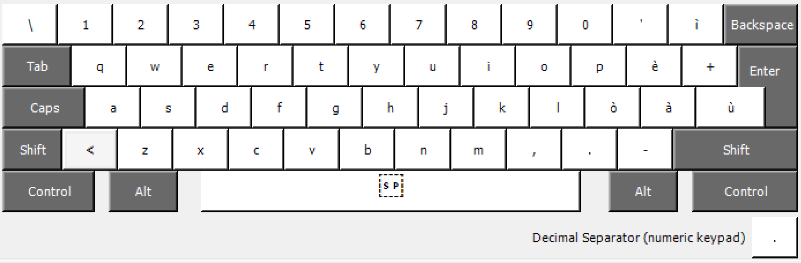
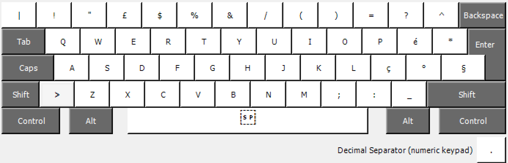
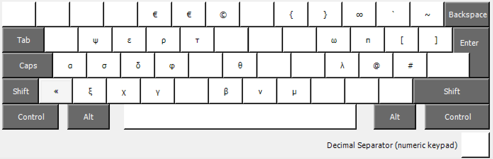

# ITA_PP Keyboard configuration
Pietro Patelli 2018-24

A custom italian keyboard that makes it easy to type programming and math symbols, as well as special characters for Spanish and German

## How to use

1. Download and install [Microsoft Keyboard Layout Creator](https://www.microsoft.com/en-us/download/details.aspx?id=102134).
2. Load *ITA_PP_source.klc*: `File > Load Source File`.
3. Build the project: `Project > Build DLL and Setup Package`.
4. Run the genarated `.exe` file to install the layout.
5. Then change your keyboard layout in the `Language preferences` section.

## Layout
Normal:



When pressing `shift`:



When pressing `AltGr` or `Ctrl + Alt`:



When pressing `shift` and `AltGr`:


### This keyboard configuration modifies the standard Windows Italian keyboard in order to add:

```
- ~ (AltGr+ì)
- ` (ALtGr+') 
- { (AltGr+8)
- } (AltGr+9)
- « (AltGr+<)
- » (AltGr+>, equivalent to AltGr+Shift+<)
- € (AltGr+4 or AltGr+5)
- ∞ (AltGr+0)
- ñ (AltGr+N)
- á (AltGr+Shift+à)
- í (AltGr+Shift+ì)
- ó (AltGr+Shift+ò)
- ú (AltGr+Shift+ù)
- ä (AltGr+Shift+a)
- ö (AltGr+Shift+o)
- ü (AltGr+Shift+u)
- ß (AltGr+Shift+z)
- ¿ (AltGr+?, equivalent to AlrGr+Shift+')
- ¡ (AltGr+!, equivalent to AltGr+Shift+1)
-  Most greek letters used in mathematical notation, such as:
      - α (AltGr+a)
      - ε (AltGr+e)
      - η (AltGr+E)
      - ξ (AltGr+z)
      - σ (AltGr+s)
      - Σ (AltGr+S)
      - π (AltGr+p)
      - Π (AltGr+P)
```
